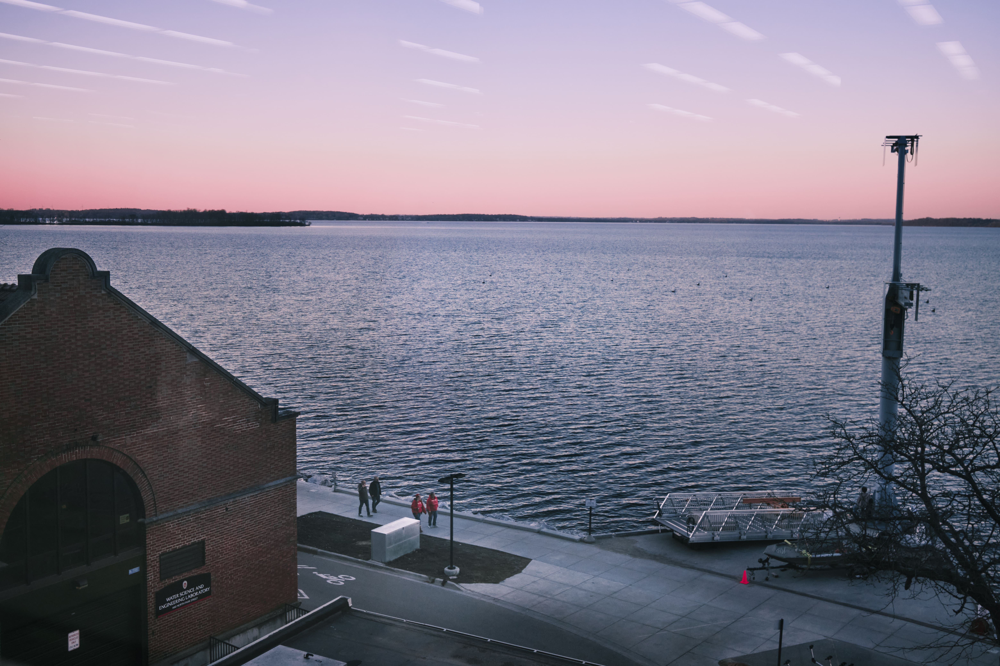
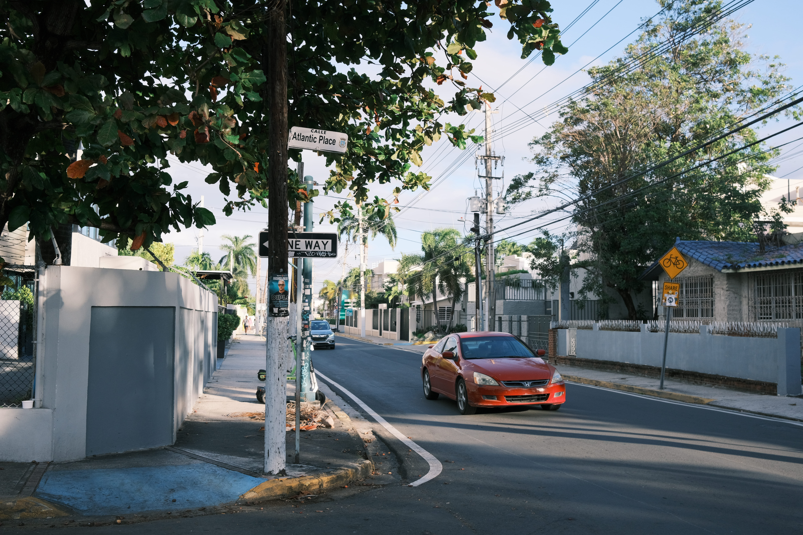

Hi there, I am a final-year undergraduate in Computer Science at ShanghaiTech University, Shanghai, China. And I will be working towards my master's at Southern University of Science and Technology (SUSTech) starting from Fall 2025. 

Previously, I have spent an amazing year as a visiting student at the University of Wisconsin-Madison.

My research interest includes deep learning, computer vision, computational imaging, and medical image analysis.

# Gallery

### Milwaukee, WI
 

### Madison, WI
 

### Madison, WI
 

### Puerto Rico
 

### Puerto Rico
 

### Milwaukee, WI
 

### Sichuan, China
 

### Sichuan, China
 

### Shanghai, China

### Shanghai, China

### ShanghaiTech University

### Xiamen, China

