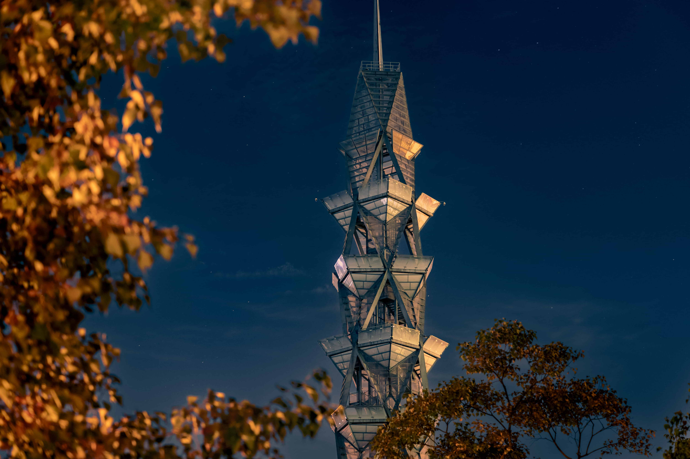

Hi! I am a junior-year undergraduate in Computer Science at ShanghaiTech University, China. Currently, I am an visiting student at the University of Wisconsin-Madison.

# Gallery

### Sichuan, China
 

### Sichuan, China
 

### Sichuan, China
 

### Sichuan, China
 

### Shanghai, China

### Shanghai, China

### Shanghai, China

### ShanghaiTech University

### Fujian, China, My hometown

<!-- My research interest includes computational imaging, single photon imaging, computer vision, and machine learning. -->